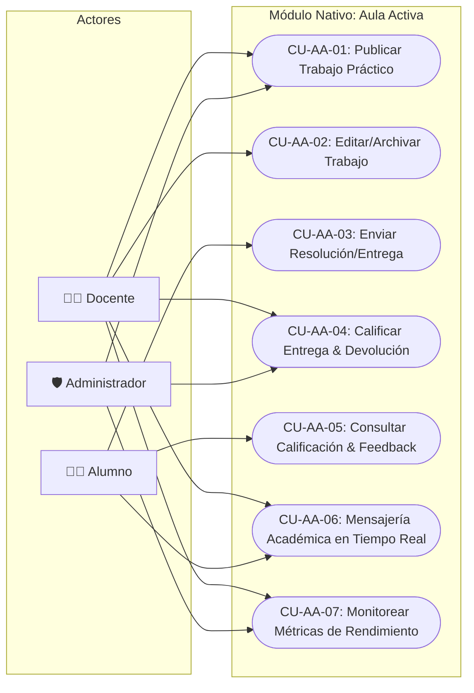

# Diagrama de Casos de Uso — Aula Activa (Módulo Nativo)

```mermaid
flowchart LR
    subgraph Actores
        Docente["👨‍🏫 Docente"]
        Alumno["👨‍🎓 Alumno"]
        Admin["🛡️ Administrador"]
    end

    subgraph Modulo_AulaActiva ["Módulo Nativo: Aula Activa"]
        CU01(["CU-AA-01: Publicar Trabajo Práctico"])
        CU02(["CU-AA-02: Editar/Archivar Trabajo"])
        CU03(["CU-AA-03: Enviar Resolución/Entrega"])
        CU04(["CU-AA-04: Calificar Entrega & Devolución"])
        CU05(["CU-AA-05: Consultar Calificación & Feedback"])
        CU06(["CU-AA-06: Mensajería Académica en Tiempo Real"])
        CU07(["CU-AA-07: Monitorear Métricas de Rendimiento"])
    end

    Docente --> CU01
    Docente --> CU02
    Docente --> CU04
    Docente --> CU06
    Docente --> CU07

    Alumno --> CU03
    Alumno --> CU05
    Alumno --> CU06

    Admin --> CU01
    Admin --> CU04
    Admin --> CU07
```
