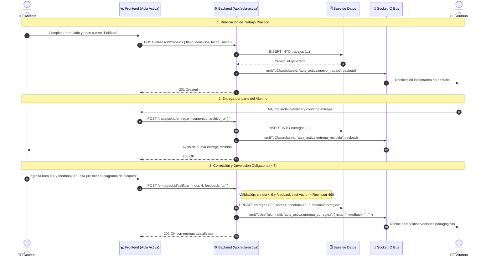

# Diagrama de Secuencia — Aula Activa (Módulo Nativo)

### Flujo Completo: Publicación -> Entrega -> Corrección con Devolución

```mermaid
sequenceDiagram
    autonumber
    actor Docente as 👨‍🏫 Docente
    participant UI as 💻 Frontend (Aula Activa)
    participant API as ⚙️ Backend (/api/aula-activa)
    participant DB as 🗄️ Base de Datos
    participant WS as 📡 Socket.IO Bus
    actor Alumno as 👨‍🎓 Alumno

    Note over Docente, Alumno: 1. Publicación de Trabajo Práctico
    Docente->>UI: Completa formulario y hace clic en "Publicar"
    UI->>API: POST /clases/:id/trabajos { titulo, consigna, fecha_limite }
    API->>DB: INSERT INTO trabajos (...)
    DB-->>API: trabajo_id generado
    API->>WS: emitToClass(claseId, 'aula_activa:nuevo_trabajo', payload)
    WS-->>Alumno: Notificación instantánea en pantalla
    API-->>UI: 201 Created

    Note over Docente, Alumno: 2. Entrega por parte del Alumno
    Alumno->>UI: Adjunta archivo/enlace y confirma entrega
    UI->>API: POST /trabajos/:id/entregar { contenido, archivo_url }
    API->>DB: INSERT INTO entregas (...)
    API->>WS: emitToClass(claseId, 'aula_activa:entrega_recibida', payload)
    WS-->>Docente: Aviso de nueva entrega recibida
    API-->>UI: 200 OK

    Note over Docente, Alumno: 3. Corrección y Devolución Obligatoria (< 6)
    Docente->>UI: Ingresa nota = 4 y feedback = "Falta justificar el diagrama de bloques"
    UI->>API: POST /entregas/:id/calificar { nota: 4, feedback: "..." }
    Note right of API: Validación: si nota < 6 y feedback está vacío -> Rechazar 400
    API->>DB: UPDATE entregas SET nota=4, feedback="...", estado='corregido'
    API->>WS: emitToUser(alumnoId, 'aula_activa:entrega_corregida', { nota: 4, feedback: "..." })
    WS-->>Alumno: Recibe nota y observaciones pedagógicas
    API-->>UI: 200 OK con entrega actualizada
```
