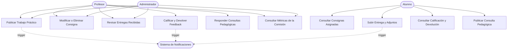

# Diagramas de Casos de Uso — EduTech Aula Activa

```mermaid
graph TD
    Profesor([Profesor])
    Alumno([Alumno])
    Admin([Administrador])
    SistemaNotif([Sistema de Notificaciones])

    %% Casos de Uso Profesor
    Profesor --> UC1[Publicar Trabajo Práctico]
    Profesor --> UC2[Modificar o Eliminar Consigna]
    Profesor --> UC3[Revisar Entregas Recibidas]
    Profesor --> UC4[Calificar y Devolver Feedback]
    Profesor --> UC5[Responder Consultas Pedagógicas]
    Profesor --> UC6[Consultar Métricas de la Comisión]

    %% Casos de Uso Alumno
    Alumno --> UC7[Consultar Consignas Asignadas]
    Alumno --> UC8[Subir Entrega y Adjuntos]
    Alumno --> UC9[Consultar Calificación y Devolución]
    Alumno --> UC10[Publicar Consulta Pedagógica]

    %% Casos de Uso Admin
    Admin --> UC1
    Admin --> UC2
    Admin --> UC3
    Admin --> UC6

    %% Sistema de Notificaciones
    UC1 -.->|trigger| SistemaNotif
    UC4 -.->|trigger| SistemaNotif
    UC8 -.->|trigger| SistemaNotif
```

