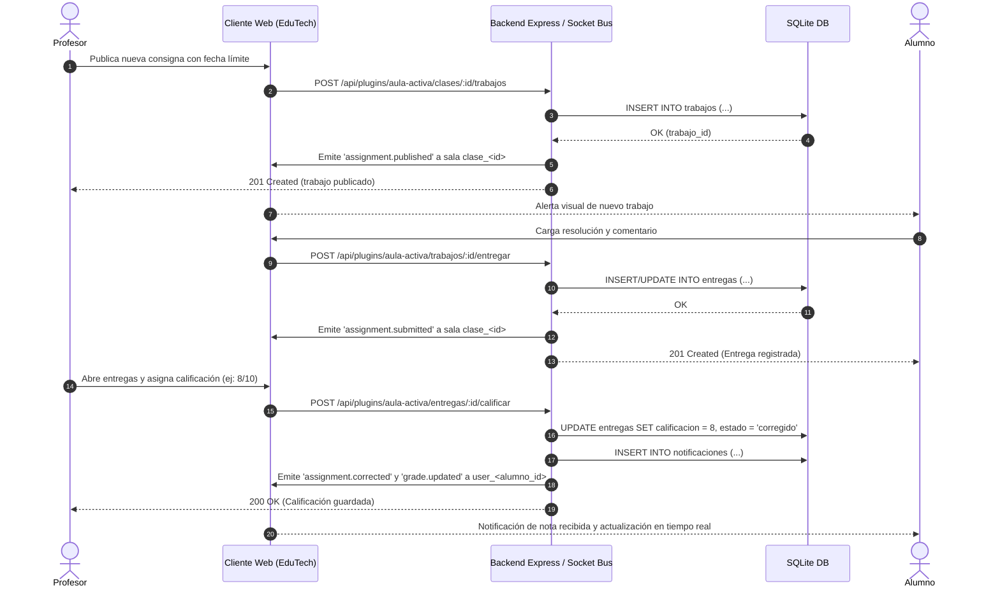

# Diagrama de Secuencia — Flujo Completo de Tarea y Calificación

```mermaid
sequenceDiagram
    autonumber
    actor Docente as Profesor
    participant Frontend as Cliente Web (EduTech)
    participant Backend as Backend Express / Socket Bus
    participant DB as SQLite DB
    actor Estudiante as Alumno

    Docente->>Frontend: Publica nueva consigna con fecha límite
    Frontend->>Backend: POST /api/plugins/aula-activa/clases/:id/trabajos
    Backend->>DB: INSERT INTO trabajos (...)
    DB-->>Backend: OK (trabajo_id)
    Backend->>Frontend: Emite 'assignment.published' a sala clase_<id>
    Backend-->>Docente: 201 Created (trabajo publicado)
    Frontend-->>Estudiante: Alerta visual de nuevo trabajo

    Estudiante->>Frontend: Carga resolución y comentario
    Frontend->>Backend: POST /api/plugins/aula-activa/trabajos/:id/entregar
    Backend->>DB: INSERT/UPDATE INTO entregas (...)
    DB-->>Backend: OK
    Backend->>Frontend: Emite 'assignment.submitted' a sala clase_<id>
    Backend-->>Estudiante: 201 Created (Entrega registrada)

    Docente->>Frontend: Abre entregas y asigna calificación (ej: 8/10)
    Frontend->>Backend: POST /api/plugins/aula-activa/entregas/:id/calificar
    Backend->>DB: UPDATE entregas SET calificacion = 8, estado = 'corregido'
    Backend->>DB: INSERT INTO notificaciones (...)
    Backend->>Frontend: Emite 'assignment.corrected' y 'grade.updated' a user_<alumno_id>
    Backend-->>Docente: 200 OK (Calificación guardada)
    Frontend-->>Estudiante: Notificación de nota recibida y actualización en tiempo real
```

