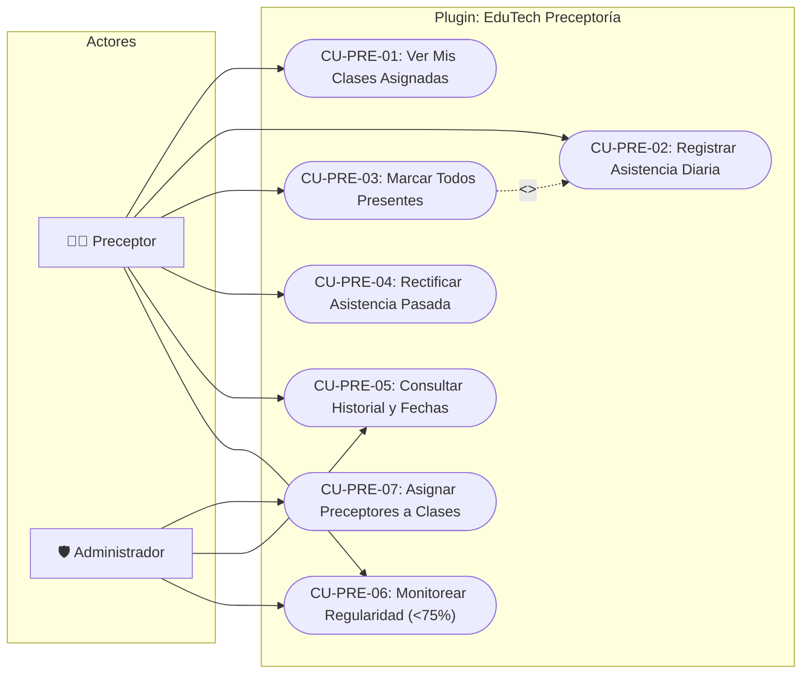

# Diagrama de Casos de Uso — Plugin Preceptoría

```mermaid
flowchart LR
    subgraph Actores
        Preceptor["🧑‍💼 Preceptor"]
        Admin["🛡️ Administrador"]
    end

    subgraph Plugin_Preceptoria ["Plugin: EduTech Preceptoría"]
        CU_MisClases(["CU-PRE-01: Ver Mis Clases Asignadas"])
        CU_TomarAsistencia(["CU-PRE-02: Registrar Asistencia Diaria"])
        CU_MarcarLote(["CU-PRE-03: Marcar Todos Presentes"])
        CU_Rectificar(["CU-PRE-04: Rectificar Asistencia Pasada"])
        CU_Historial(["CU-PRE-05: Consultar Historial y Fechas"])
        CU_Estadisticas(["CU-PRE-06: Monitorear Regularidad (<75%)"])
        CU_AsignarClases(["CU-PRE-07: Asignar Preceptores a Clases"])
    end

    Preceptor --> CU_MisClases
    Preceptor --> CU_TomarAsistencia
    Preceptor --> CU_MarcarLote
    Preceptor --> CU_Rectificar
    Preceptor --> CU_Historial
    Preceptor --> CU_Estadisticas

    Admin --> CU_AsignarClases
    Admin --> CU_Historial
    Admin --> CU_Estadisticas

    CU_MarcarLote -.-> |<<extend>>| CU_TomarAsistencia
```
