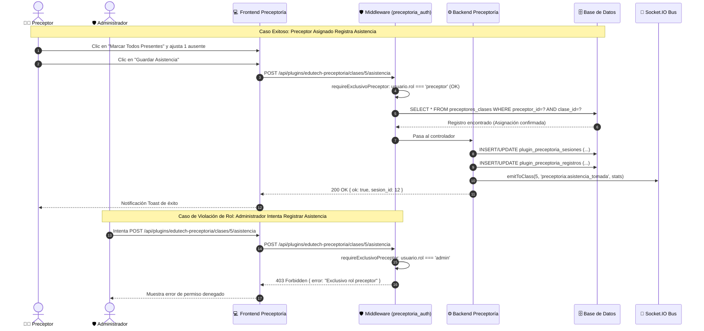

# Diagrama de Secuencia — Plugin Preceptoría

### Flujo de Toma de Asistencia y Bloqueo de Roles No Autorizados

```mermaid
sequenceDiagram
    autonumber
    actor Preceptor as 🧑‍💼 Preceptor
    actor Admin as 🛡️ Administrador
    participant UI as 💻 Frontend Preceptoría
    participant MW as 🛡️ Middleware (preceptoria_auth)
    participant API as ⚙️ Backend Preceptoría
    participant DB as 🗄️ Base de Datos
    participant WS as 📡 Socket.IO Bus

    Note over Preceptor, DB: Caso Exitoso: Preceptor Asignado Registra Asistencia
    Preceptor->>UI: Clic en "Marcar Todos Presentes" y ajusta 1 ausente
    Preceptor->>UI: Clic en "Guardar Asistencia"
    UI->>MW: POST /api/plugins/edutech-preceptoria/clases/5/asistencia
    MW->>MW: requireExclusivoPreceptor: usuario.rol === 'preceptor' (OK)
    MW->>DB: SELECT * FROM preceptores_clases WHERE preceptor_id=? AND clase_id=?
    DB-->>MW: Registro encontrado (Asignación confirmada)
    MW->>API: Pasa al controlador
    API->>DB: INSERT/UPDATE plugin_preceptoria_sesiones (...)
    API->>DB: INSERT/UPDATE plugin_preceptoria_registros (...)
    API->>WS: emitToClass(5, 'preceptoria:asistencia_tomada', stats)
    API-->>UI: 200 OK { ok: true, sesion_id: 12 }
    UI-->>Preceptor: Notificación Toast de éxito

    Note over Admin, MW: Caso de Violación de Rol: Administrador Intenta Registrar Asistencia
    Admin->>UI: Intenta POST /api/plugins/edutech-preceptoria/clases/5/asistencia
    UI->>MW: POST /api/plugins/edutech-preceptoria/clases/5/asistencia
    MW->>MW: requireExclusivoPreceptor: usuario.rol === 'admin'
    MW-->>UI: 403 Forbidden { error: "Exclusivo rol preceptor" }
    UI-->>Admin: Muestra error de permiso denegado
```
