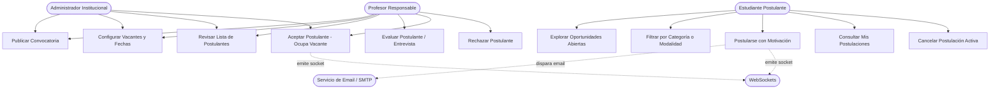

# Diagramas de Casos de Uso — EduTech Oportunidades

```mermaid
graph TD
    AdminInst([Administrador Institucional])
    Docente([Profesor Responsable])
    Estudiante([Estudiante Postulante])
    ServicioEmail([Servicio de Email / SMTP])
    SocketBus([WebSockets])

    %% Casos de Uso de Responsables
    Docente --> UC1[Publicar Convocatoria]
    Docente --> UC2[Configurar Vacantes y Fechas]
    Docente --> UC3[Revisar Lista de Postulantes]
    Docente --> UC4[Evaluar Postulante / Entrevista]
    Docente --> UC5[Aceptar Postulante - Ocupa Vacante]
    Docente --> UC6[Rechazar Postulante]

    %% Casos de Uso del Alumno
    Estudiante --> UC7[Explorar Oportunidades Abiertas]
    Estudiante --> UC8[Filtrar por Categoría o Modalidad]
    Estudiante --> UC9[Postularse con Motivación]
    Estudiante --> UC10[Consultar Mis Postulaciones]
    Estudiante --> UC11[Cancelar Postulación Activa]

    %% Casos de Uso Admin
    AdminInst --> UC1
    AdminInst --> UC2
    AdminInst --> UC3
    AdminInst --> UC5

    %% Integraciones
    UC9 -.->|dispara email| ServicioEmail
    UC9 -.->|emite socket| SocketBus
    UC5 -.->|emite socket| SocketBus
```

