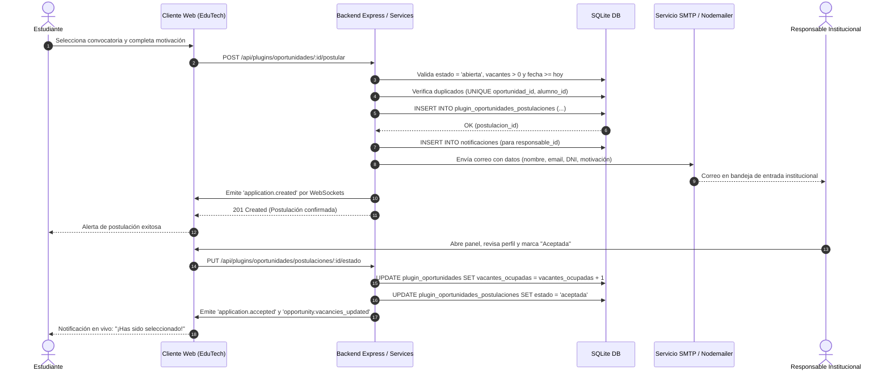

# Diagrama de Secuencia — Flujo de Postulación y Notificación al Responsable

```mermaid
sequenceDiagram
    autonumber
    actor Alumno as Estudiante
    participant Frontend as Cliente Web (EduTech)
    participant Backend as Backend Express / Services
    participant DB as SQLite DB
    participant Mail as Servicio SMTP / Nodemailer
    actor Docente as Responsable Institucional

    Alumno->>Frontend: Selecciona convocatoria y completa motivación
    Frontend->>Backend: POST /api/plugins/oportunidades/:id/postular
    Backend->>DB: Valida estado = 'abierta', vacantes > 0 y fecha >= hoy
    Backend->>DB: Verifica duplicados (UNIQUE oportunidad_id, alumno_id)
    Backend->>DB: INSERT INTO plugin_oportunidades_postulaciones (...)
    DB-->>Backend: OK (postulacion_id)
    Backend->>DB: INSERT INTO notificaciones (para responsable_id)

    Backend->>Mail: Envía correo con datos (nombre, email, DNI, motivación)
    Mail-->>Docente: Correo en bandeja de entrada institucional

    Backend->>Frontend: Emite 'application.created' por WebSockets
    Backend-->>Frontend: 201 Created (Postulación confirmada)
    Frontend-->>Alumno: Alerta de postulación exitosa

    Docente->>Frontend: Abre panel, revisa perfil y marca "Aceptada"
    Frontend->>Backend: PUT /api/plugins/oportunidades/postulaciones/:id/estado
    Backend->>DB: UPDATE plugin_oportunidades SET vacantes_ocupadas = vacantes_ocupadas + 1
    Backend->>DB: UPDATE plugin_oportunidades_postulaciones SET estado = 'aceptada'
    Backend->>Frontend: Emite 'application.accepted' y 'opportunity.vacancies_updated'
    Frontend-->>Alumno: Notificación en vivo: "¡Has sido seleccionado!"
```

